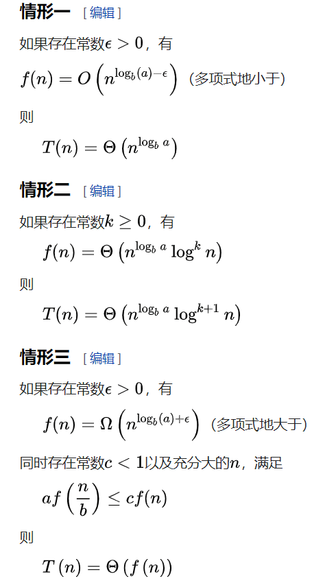
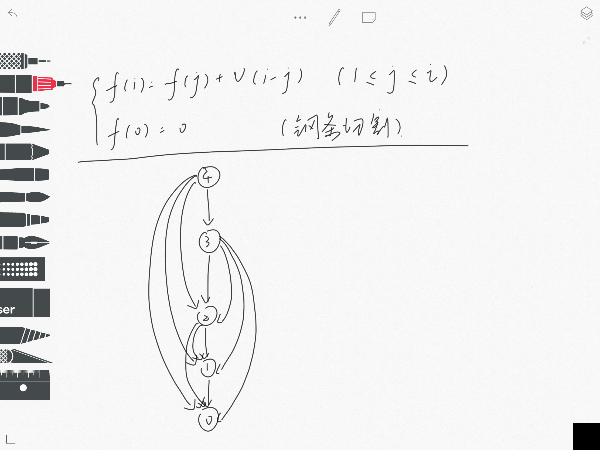
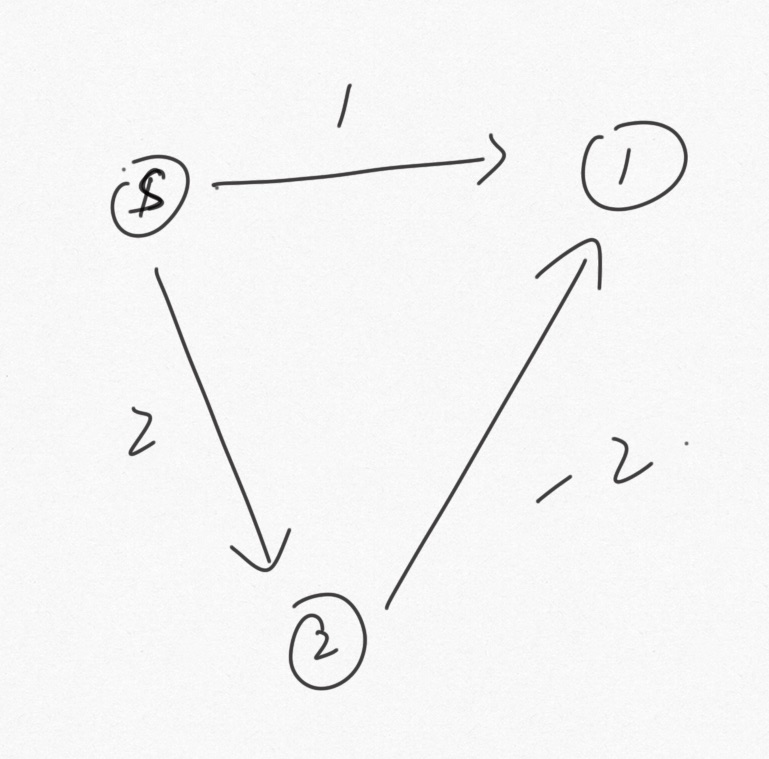

# Algorithm Review

## Theory

1. 算法的基本概念和性质

- 概念
  
    >   - 算法是一组**有穷**的规则，它规定了解决**某一类特定问题**的一系列**运算**
  
- 性质

    >   - **确定性**: 算法使用的每种运算都有确定的规则，不能有二义性
    >   - **能行性**: 算法中有待实现的运算都是基本运算，原理上这些运算都能由人用纸和笔完成
    >   - **输入**: 每个算法都有0个或者多个输入
    >   - **输出**: 一个算法产生一个或多个输出，这些输出是与输入有某种特定关系的量
    >   - **有穷性**: 一个算法总是在执行了有穷步之后停止

2. $O$、$Ω$、$Θ$  记号的定义和相关性质及其证明

- $O$

>- 定义：$O(g(x))$ 是 $0  \le f(x) \le c*g(x) $ 的集合，即如果存在正常数$c_1,c_2$，使对于所有的$n > n_0$ 有 $ |f(x)| \le c*|g(x)|$, 记为 $f(x) = O(g(x))$
>- 给出了一个渐进上界

- $Ω$

>- 定义： 给了一个渐进下界

- $Θ$

>- 定义：$Θ(g(x))$ 是 $0 \le c_1*g(x) \le f(x) \le c_2*g(x) $ 的集合，即如果存在正常数$c_1,c_2$，使对于所有的$n > n_0$ 有 $c_1*|g(x)| \le |f(x)| \le c_2*|g(x)|$, 记为 $f(x) = Θ(g(x))$
>- $g(n)$是$f(n)$的渐进紧缺界函数，即算法在最好情况和最坏情况下的计算时间在一个常数因子下是相同的，可以看做 $f(n) = O(g(n))$ 并且 $g(n) = O(f(n))$
>- 一个渐进正函数的低阶项在确定渐进紧确界的时候可以忽略，就是说$x^2+x$可以忽略成$x^2$
>- $Θ(1)$ 任何一个常量的复杂度

3. 什么是循环不变关系？用循环不变关系证明循环的正确性

- 循环不变性： 在第一次进入循环之前成立，每次循环之后还成立的关系称为“循环不变式”
- 证明
  
> - **初始化**：初始条件为真
> - **保持**：每次循环之后循环不变式依旧为真 
> - **终止**：循环可以有限次终止 
> 以插入排序做例子

4. 分治法的基本思想

- 将原问题分解为几个规模较小，但是**类似**于原问题的子问题，**递归**的求解这些子问题，再**合并**这些子问题建立原问题的解

5. TODO

1. 为什么我们更关心算法的最坏情况

- 废话

7. 用代换法、递归树法解决递推式的思想 //不会

- 代换法：猜一个数带进去，证明

- 递归树法:TODO

8. 主方法及其应用

>- 对于$T(n) = aT(n/b)+f(n) $
> 

10. 平均运行时间和期望运行时间

>- 平均运行时间： 对于所有可能输入产生的运行时间取平均
>- 期望运行时间：一个随机算法的运行时间

11.

>- 顺序统计量:由N个元素组成的几个，第i个顺序统计量是该集合的第i个元素
>- 中位数:n个元素的集合，将数据排列之后排在中间的数，偶数时(n/2)处为下中位数，(n/2)+1时为上中位数，一般取下中位数
>- 带权中位数

12.

13. 最优化问题

>- 一类问题的可行解可能有很多个，每个解都有一个评价优劣的值，我们希望寻找具有最优值的解

14.

>- 最优子结构：如果整个序列是最优决策序列，那么该序列中的任何一段子序列对于该序列对应的子问题也是最优的.
>- 无后效性：未求解的状态只与当前的状态有关，与当前状态是怎么来的无关
>- 证明：反证法，假设当前是最优解，然后去掉一段，贴上一段更优的，发现当前最优解变得更优了，假设错误

15.

>- 状态转移方程:阶段之间的状态变化量的变化存在一定关系，从$i$阶段转移到$i+1$阶段的状态转移规律叫状态转移方程

16. 子问题图的画法

>- 子问题图：用于描述子问题与子问题之间关系依赖关系的图
>- 

17. 简述DP的改进

>- DP本质上是一种利用空间换取时间效率的方法，将需要重复计算的部分记录下来，保证了重复计算的部分只会被计算一次，解决了重叠子问题，将指数级的搜索时间复杂度降低为多项式级别，有效的降低了时间复杂度。
>- 在计算过程中一般只保留了最优解，而放弃了次优解（次短路问题也保留了次优解），因此很有可能有多项式时间的复杂度。
>- 通过巧妙的状态设计，同样可以用相对较小的空间来保存状态，实现了时空的平衡。

18. 贪心的基本思想

>- 在每一步仅做出当时看起来最优的选择，即**局部最优选择**，并希望通过这种选择找到**全局最优解**
>- 贪心选择：在贪心算法中的每一步所做的当前最优选择
>- 贪心选择性：可以通过局部最优解，构造出全局最优解

19. 贪心和DP的异同

>- 同：都是用于求解最优化问题的方法，都具有最优子结构性，都降低了算法的复杂度。
>- 异：本质上动态规划依旧遍历了所有状态，所有状态进行比较找到最优解，但是贪心在不断决策的过程中舍弃了大量无效状态的计算，比动态规划的复杂度第，动态规划是贪心算法的泛化

20.

>- 切割：无向图$G=(V,E)$，$(S,V-S)$是一个切割
>- 横跨切割: 一条边一个端点在集合$S$中，另一个在$(V-S)$中，则这条边横跨这个切割
>- 轻量级边：在横跨切割的所有边中，权重最小的边称为轻量级边，轻量级边可以不唯一
>- 安全边：???

22. 松弛操作

>- 测试是否可以对从s到v的最短路径金慈宁宫改善，如果可以改善，则v.d更新为新的最短路径估计值，这就是松弛操作

23.

- 三角形不等式：$dis(u,v) \le dis(s,u) + w(u,v)$
    >- 假设存在最短路$p$，那么其他路径的长度一定大于$p$,包括现在说的这条路径
    >- 如果不存在，就没有路径，就都是无穷
- 上界性质：在初始和松弛过程中，永远有$v.d >= dis(s,v)$
    >- 归纳法证明

- 路径松弛性质:结果跟松弛次序无关
    >- 归纳法证明

24. 举例带负权边炸掉的dij
- 不满足的原因是每个加入$S$中的节点$dis$不在改变，但是有负权边可能会毁掉这个性质
- 

25. Bellman-Ford 算法是如何检查图中可能存在的负权重回路的

- 如果包含回路，则在$(n-1)$次迭代之后，依然存在着$v.d > u.d + w(u,v)$ , 说明迭代还没有结束，但是一条路径最多包含$(n)$个点，所以此时有回路

26. TODO

27. 
- DFS:深度优先搜索
- BFS:广度优先搜索
- D-Search：利用栈的宽度优先搜索
> 同：都是搜索算法
> 异：节点生成的顺序不一样

29. （个人理解）
- 回溯法：dfs+剪枝
- 分支限界：bfs+剪枝

30. 

- 状态空间：由根节点到其他节点的所有路径
- 解空间：所有可能的不同元祖，共$2^n$元祖
- 状态空间树：解空间的树结构
- 检索：
- 周游：

31. LC检索（一个人在bb）

- 设置估价排序函数，选取估计代价最小的节点作为下一个要搜索的节点
- 我觉得说白了就是IDA*

32. 

- 节点成本函数 $C(x) = f(g(x)) + h(x)$
- $g(x)$是成本估计函数，会使他偏向纵深检查，比如越往下搜索，$g(x)$的值就会越小，被选到的可能性就会大
- $h(x)$是已发生的成本的函数，$f(x)$是个非降函数，会使偏向水平检查
- 最终导致优先检索更接近答案但是离根尽量近的节点

33

34. 
- 流网络：有向图，有容量，有源有汇
- 最大流：在不违反路径容量限制的条件下，从源节点到汇节点运送货物的最大速率

35. 
- 最大流=最小割
- FF：随意增广，复杂度$O（E*F）$

36. EK算法
- 增广的时候找最短路增广，复杂度将与容量无关$O（VE^2）$
